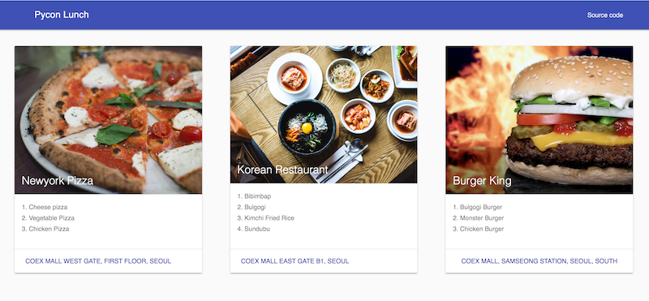

# Django for mobile applications
Sample code and resources for [PyCon Kr 2017 presentation](https://www.pycon.kr/2017/program/163)

## How to run 

1. git clone
```bash
$ git clone https://github.com/hassanabidpk/pyconkr2017.git
$ python3 -m venv myven
$ source myvenv/bin/activate
$ cd pyconkr2017

```
2. Install requirments

```bash
$ pip install -r requirements.txt
```
3. Make migrations and create user
```bash
$ python manage.py migrate
$ python manage.py createsuperuser
```
4. Start Server

```bash
$ python manage.py runserver

```

## Sample data
You can find sample images and data in dummy folder

## Rest API end point

`/api/list`

## Final output



## React Native App [Github](https://github.com/hassanabidpk/react_pyconlunch/)


